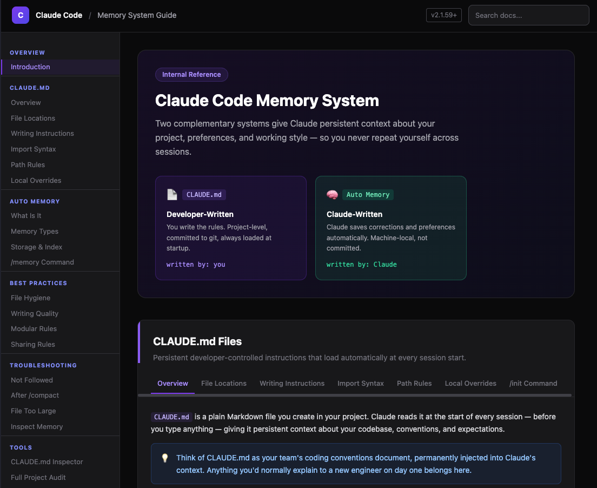

# Claude Code Memory System Guide

An interactive engineering guide for Claude Code's persistent memory system — covering how to set it up, write good memories, and use them effectively across sessions.

## What's inside

A single-page reference (`index.html`) with:

- **CLAUDE.md files** — project and global instructions loaded at session start
- **Auto memory** — how Claude reads and writes persistent memory files
- **Memory types** — `user`, `feedback`, `project`, and `reference`
- **Best practices** — what to save, what to skip, how to structure entries
- **Troubleshooting** — common issues and how to fix them
- **Tools** — a CLAUDE.md Inspector (paste your file, get instant quality feedback) and a Full Project Audit prompt to run inside Claude Code for whole-project analysis

## Usage

Open `index.html` directly in a browser — no build step or server needed.
